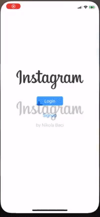

# Parstagram - Part I

This is an Instagram clone with a custom Parse backend that allows a user to post photos and view a global photos feed.

Time spent: **X** hours spent in total

## User Stories

The following **required** functionality is completed:

- [x] User sees app icon in home screen and styled launch screen. (1pt)
- [x] User can sign up to create a new account. (1pt)
- [x] User can log in. (1pt)
- [x] User can take a photo, add a caption, and post it to the server. (3pt)
- [x] User can view the last 20 posts. (4pts)

The following **bonus** features are implemented:

- [x] User can pull to refresh. (1pt)
- [ ] User can load past posts infinitely. (2pts)
- [x] User can logout
- [x] User can view profile and their posts
- [x] User can edit profile: profile picture, full name, bio
- [x] User can delete posts
- [x] Camera Manager
- [x] Tab bar to switch between home screen and profile screen

## Video Walkthrough

Here's a walkthrough of the required user stories:

Here's a walkthrough of the optional user stories:

